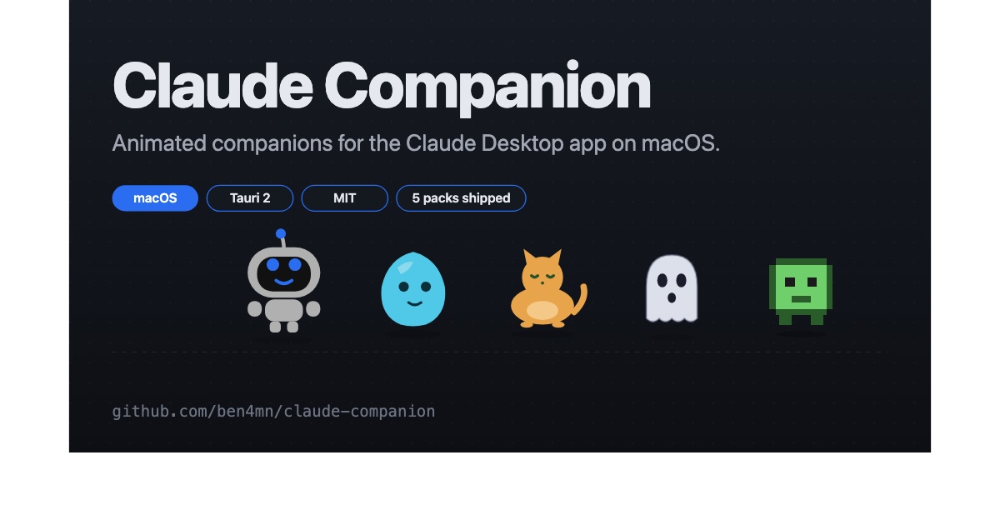

<div align="center">



# Claude Companion

**Animated companions for the [Claude Desktop](https://claude.com/download) app on macOS.**

A tiny always-on-top overlay that lives on the bottom edge of your Claude window.
Pick one up. Throw them around. Watch them land.

[**Live demo →**](https://ben4mn.github.io/claude-companion/) &nbsp;·&nbsp;
[Install](#install) &nbsp;·&nbsp;
[How it works](#how-it-works) &nbsp;·&nbsp;
[Roadmap](#roadmap)

[](#install)
[](https://tauri.app)
[](#architecture)
[](LICENSE)
[](#roadmap)
[](https://github.com/ben4mn/claude-companion)

</div>

---

## Meet the cast

Five companions ship out of the box. Swap any time from the tray menu.

<div align="center">

<table>
<tr>
  <td align="center" width="20%"><br /><b>Pane</b><br /><sub>SVG robot from PaneStreet</sub></td>
  <td align="center" width="20%"><br /><b>Blob</b><br /><sub>A gelatinous companion</sub></td>
  <td align="center" width="20%"><br /><b>Cat</b><br /><sub>A minimal line-art cat</sub></td>
  <td align="center" width="20%"><br /><b>Ghost</b><br /><sub>A friendly spectral drift</sub></td>
  <td align="center" width="20%"><br /><b>Sprite</b><br /><sub>A 16-bit pixel creature</sub></td>
</tr>
</table>

</div>

## Why

Anthropic doesn't ship a plugin API for putting custom visual components inside the Claude Desktop window — `.mcpb` Desktop Extensions add tools but no UI, and MCP-UI widgets only render inside chat messages. Claude Companion gets the same effect by running as a separate, always-on-top, transparent, click-through Tauri window that tracks Claude's frontmost state and window bounds.

**Claude Desktop is never touched.**

## Install

Requires Rust + Node. macOS only for now.

```bash
git clone https://github.com/ben4mn/claude-companion.git
cd claude-companion
pnpm install        # or npm install
pnpm tauri dev      # first build compiles the Rust tree (~3–5 min)
```

Your companion appears bottom-right of your Claude Desktop window. Quit via the menu-bar tray icon.

## How it works

**Three states**

| State | What's happening |
|-------|------------------|
| **Grounded** | Normal life — wanders the bottom edge of Claude's window, cycles idle activities (wave, think, sleep, dance, type, sweep, phone, code, …), occasional speech bubbles. |
| **Held** | You click-and-hold. Arms flail, eyes go wide. Window follows your cursor at 60fps. Drop them anywhere. |
| **Falling** | You let go. Gravity pulls them down until they land on Claude's bottom edge, where they resume Grounded life. |

**Claude-tracking**

- **Appears** with a bottom-right snap when the companion first launches and Claude is open
- **Hides** when you switch to any other app (Chrome, Finder, etc.) — your screen stays clean
- **Reappears** when you come back to Claude
- **Quits itself** when you quit Claude Desktop
- **Clicking the companion doesn't make it vanish** — the watcher knows when it's being interacted with

**Stays out of your way**

- No Dock icon, no app-switcher entry, no menu bar (macOS `Accessory` activation policy)
- Per-pixel click-through — clicks on empty space pass through to Claude Desktop beneath
- Always-on-top, transparent, no window chrome

## Companion packs

Every character ships as a folder under `src/packs/<id>/`:

```
packs/pane/
├── manifest.json    # id, name, theme colors, viewBox
├── body.svg         # the character
├── animations.css   # all act-* keyframes (20+ for Pane)
└── speech.json      # speech pools (activity, idle, time-of-day, pet, secret)
```

Adding a new character is a matter of dropping a folder here and pointing `loadPack()` at it in `src/engine/behavior.js`. The Companion Pack spec will stabilize in v1.0.

## Architecture

```
claude-companion/
├── src-tauri/              # Rust — window, watcher, IPC commands
│   ├── src/lib.rs          # Main entry + command dispatch
│   ├── src/app_watcher.rs  # Tracks Claude's window bounds & frontmost state
│   ├── src/hotkeys.rs      # Keyboard binding system
│   ├── src/settings.rs     # Persisted user configuration
│   └── tauri.conf.json     # transparent, frameless, always-on-top, focus:false
├── src/
│   ├── index.html          # Companion stage
│   ├── engine/behavior.js  # State machine: grounded / held / falling
│   ├── styles/base.css     # Pack-agnostic window layout
│   └── packs/              # Companion packs (pane, blob, cat, ghost, sprite)
└── docs/                   # GitHub Pages site — https://ben4mn.github.io/claude-companion/
```

**Rust commands (JS-callable)**

- `cursor_over(bbox)` — hit-test global cursor against the mascot's DOM bbox. Drives click-through.
- `pane_follow_cursor(offsetX, offsetY)` — move window so cursor stays at a fixed offset. Used by the `Held` loop.
- `pane_set_position(x, y)` — move window to absolute logical coords. Used by `Falling` and `Grounded` walk.
- `pane_ground()` — returns `(groundY, minX, maxX)` derived from Claude's on-screen window.
- `pane_set_interacting(active)` — pauses the watcher so a drag can't be yanked mid-motion.

**macOS APIs used**

- `NSApplication.setActivationPolicy(.accessory)` — no Dock icon / app switcher
- `NSWorkspace.sharedWorkspace` — `runningApplications`, `frontmostApplication`
- `NSEvent.mouseLocation` — global cursor polling
- `NSScreen` — primary-screen height for coordinate flip
- `CGWindowListCopyWindowInfo` — Claude Desktop's on-screen window frame (no Accessibility permission required)

## Roadmap

- **v0.2** — import the remaining PaneStreet animations (moonwalk, watching-build, impressed, falling-arms already present; hiccup / stumble / startled / double-take / yawn wired into the random idle picker)
- **v0.3** — optional bundled MCP server so Claude (the model) can emit structured events the companion reacts to (thinking / done / error), inspired by [claude-buddy](https://github.com/1270011/claude-buddy)
- **v0.4** — Windows + Linux builds, auto-start at login
- **v1.0** — Companion Pack spec frozen, second reference character shipped, `.dmg` + one-click install

## Ported code

Pane's visual assets come from [PaneStreet](https://github.com/ben4mn/panestreet):

- SVG body → `src/packs/pane/body.svg` (from `PaneStreet/src/index.html:90-148`)
- All `act-*` + `robot-*` keyframes → `src/packs/pane/animations.css` (from `PaneStreet/src/css/main.css:1473-2346`)
- Behavior engine (trimmed and refactored into a state machine) → `src/engine/behavior.js` (from `PaneStreet/src/js/app.js:2670-4060`)

## Legal

- "Claude" and "Claude Desktop" are trademarks of Anthropic PBC. This project is unaffiliated with and unendorsed by Anthropic. It observes Claude Desktop via public macOS APIs (NSWorkspace + CGWindow); it does not modify, reverse engineer, or interact with Claude Desktop internals.
- Pane artwork and animation design © ben4mn, reused from PaneStreet.
- Code in this repository is MIT-licensed. See [LICENSE](LICENSE).

---

<div align="center">
<sub>Built by <a href="https://github.com/ben4mn">@ben4mn</a> · <a href="https://ben4mn.github.io/claude-companion/">Landing page</a></sub>
</div>
